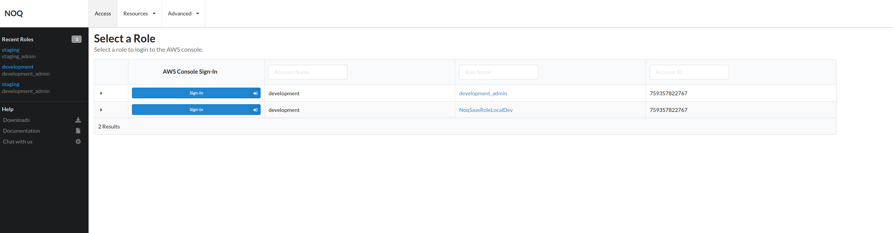

# Debug

# Troubleshooting

## Login list disappears



- Symptoms: all or most logins disappear
- Root cause: redis gets into a weird/bad state
- Fix:

  - Ask for the AWS keys (ie. Curtis to issue "break glass" creds)
  - Login to the celery worker: `aws ecs execute-command --cluster noq-dev-shared-prod-1 --region us-west-2 --task 425d25da36b74dad9134dd8eac7186e6 --container noq-dev-shared-prod-1-celery --command "/bin/bash" --interactive`
  - Install ipython: `pip install ipython`
  - Launch `ipython`
  - Set the path:

    ```python
    import os
    import sys

    for mod in os.listdir("/app"):
      if mod.startswith("cloudumi_"):
        sys.path.append(f"/app/{mod}")
    ```

  - Copy and paste the [initialize_redis.py script](https://github.com/noqdev/cloudumi/blob/main/common/scripts/initialize_redis.py) into the IPython window
